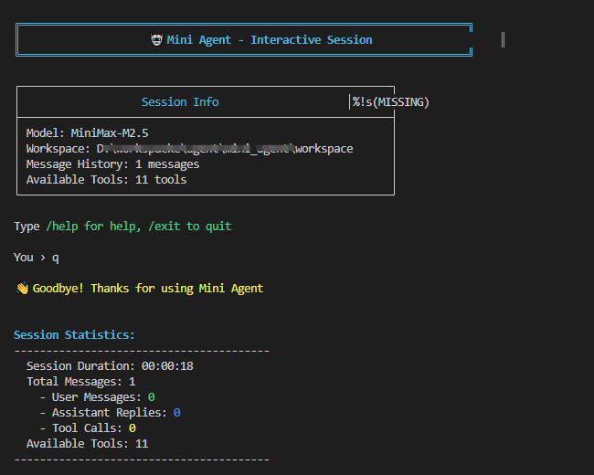

# Mini-Agent

**中文** | [English](./README_EN.md)

一个使用 Go 语言编写的交互式 AI Agent 框架，通过结合文本生成和工具执行来完成复杂任务。

## 功能特性

- **多轮对话** - 与 Agent 进行迭代式对话
- **工具执行** - 执行 bash 命令、读写文件、管理笔记
- **多 LLM 提供商** - 支持 OpenAI 和 Anthropic 兼容 API
- **Token 管理** - 当上下文超出限制时自动摘要
- **重试机制** - API 失败时指数退避重试
- **MCP 支持** - 连接 Model Context Protocol 服务器扩展工具
- **持久化记忆** - 跨会话记忆用户偏好和重要信息

## 运行截图



## 项目结构

```
mini_agent/
├── cmd/
│   └── mini-agent/
│       └── main.go              # 入口点，CLI 处理，REPL 循环
├── pkg/
│   ├── agent/
│   │   └── agent.go             # 核心 Agent：决策循环、消息管理
│   ├── config/
│   │   └── config.go            # YAML 配置加载
│   ├── schema/
│   │   └── schema.go            # Message, ToolCall, LLMResponse 类型
│   ├── llm/
│   │   ├── base.go               # LLMClientBase 接口
│   │   ├── llm_wrapper.go        # 提供商路由 (Anthropic/OpenAI)
│   │   ├── openai_client.go      # OpenAI 兼容 API 客户端
│   │   ├── anthropic_client.go    # Anthropic API 客户端
│   │   └── retry.go              # 指数退避重试逻辑
│   ├── tools/
│   │   ├── base.go               # 工具接口定义
│   │   ├── bash_tool.go          # Bash/PowerShell 执行
│   │   ├── file_tools.go         # 文件读写编辑操作
│   │   ├── note_tool.go          # 会话笔记记录
│   │   └── memory_tool.go        # 持久化记忆工具
│   ├── mcp/
│   │   └── client.go             # MCP Client 实现
│   ├── logger/
│   │   └── logger.go             # 请求/响应日志
│   ├── utils/
│   │   └── terminal.go           # 显示宽度计算
│   └── acp/
│       └── server.go             # Model Context Protocol 服务端
├── config/
│   └── config.yaml               # 配置文件
├── mcp/
│   └── mcp.json                  # MCP 服务器配置
├── go.mod                        # Go 模块定义
└── go.sum                        # 依赖校验和
```

## 安装

### 前置条件

- Go 1.21+
- OpenAI 或 Anthropic API 访问权限（或兼容服务如 MiniMax）
- `uvx`（用于 MCP 服务器，如需使用 MCP 功能）

### 构建

```bash
git clone <repository>
cd mini_agent
go build -o mini-agent ./cmd/mini-agent
```

## 配置

### 环境变量

```bash
# MiniMax API Key（必需）
export MINIMAX_API_KEY="your-api-key"

# 或 Windows PowerShell
$env:MINIMAX_API_KEY = "your-api-key"
```

### 配置文件

在以下位置之一创建 `config.yaml`（按顺序搜索）：

1. `./mini_agent/config/config.yaml`
2. `~/.mini-agent/config/config.yaml`
3. `<executable_dir>/config/config.yaml`

### 配置选项

```yaml
# LLM 配置
llm:
  api_key: ""                              # 使用 MINIMAX_API_KEY 环境变量
  api_base: "https://api.minimaxi.com"    # API 端点
  model: "MiniMax-M2.5"                   # 模型名称
  provider: "anthropic"                   # "anthropic" 或 "openai"

  retry:
    enabled: true
    max_retries: 3
    initial_delay: 1.0
    max_delay: 60.0
    exponential_base: 2.0

# Agent 配置
agent:
  max_steps: 100                           # 最大工具调用迭代次数
  workspace_dir: "./workspace"             # 工作目录
  system_prompt_path: "system_prompt.md"

# 工具配置
tools:
  enable_file_tools: true                  # 文件读写编辑
  enable_bash: true                        # 执行命令
  enable_note: true                        # 会话笔记
  enable_persistent_memory: true           # 持久化记忆
  enable_mcp: true                         # MCP 支持
  mcp_config_path: "mini_agent/mcp"
  mcp:
    connect_timeout: 10.0
    execute_timeout: 60.0
    sse_read_timeout: 120.0
```

### MCP 配置 (mcp.json)

```json
{
  "servers": [
    {
      "name": "MiniMax",
      "command": "uvx",
      "args": ["minimax-coding-plan-mcp", "-y"],
      "env": [
        "MINIMAX_API_KEY=your-api-key",
        "MINIMAX_API_HOST=https://api.minimaxi.com"
      ]
    }
  ]
}
```

**注意**：Windows 用户需先安装 `uv`：

```powershell
powershell -ExecutionPolicy ByPass -c "irm https://astral.sh/uv/install.ps1 | iex"
```

## 使用

### 交互模式

```bash
./mini-agent --workspace /path/to/project
```

命令：

- `/help` - 显示帮助
- `/clear` - 清除会话历史
- `/history` - 显示消息数量
- `/stats` - 显示会话统计
- `/exit`, `/quit`, `/q` - 退出程序

### 任务模式

```bash
./mini-agent --workspace /path/to/project --task "Your task here"
```

## 执行流程

本项目采用 **ReAct** (Reasoning + Acting) 模式，由 **Princeton + Google** 2022 年提出。

### 核心循环

```
┌─────────────────────────────────────────────────────────────┐
│                     ReAct Loop                              │
├─────────────────────────────────────────────────────────────┤
│                                                              │
│  for step < MaxSteps:                                       │
│                                                              │
│  ┌───────────┐  1. Think - LLM 思考需要什么工具            │
│  │  Thought  │                                              │
│  └─────┬─────┘                                              │
│        ▼                                                    │
│  ┌───────────┐  2. Act - 调用工具执行动作                    │
│  │   Action  │                                              │
│  └─────┬─────┘                                              │
│        ▼                                                    │
│  ┌───────────┐  3. Observe - 获取工具返回结果                │
│  │  Observe  │                                              │
│  └─────┬─────┘                                              │
│        │                                                    │
│        ▼                                                    │
│  ┌───────────┐  4. Reason - 基于结果判断是否继续            │
│  │  Reason   │ ───► 继续循环或返回结果                      │
│  └───────────┘                                              │
│                                                              │
└─────────────────────────────────────────────────────────────┘
```

### 执行阶段详解

| 阶段 | 说明 | 代码体现 |
|------|------|---------|
| **Thought** | LLM 分析任务，决定是否调用工具 | `🧠 Thinking:` 显示 |
| **Action** | 执行工具调用 | `🔧 Tool Call:` |
| **Observe** | 获取工具返回结果 | `✓ Result:` |
| **Reason** | 判断下一步：继续循环或返回结果 | 回到第1步或结束 |

### 本项目流程图

```
┌─────────────┐     ┌─────────────┐     ┌─────────────┐     ┌─────────────┐
│   User      │     │   Agent     │     │    LLM      │     │   Tools     │
└──────┬──────┘     └──────┬──────┘     └──────┬──────┘     └──────┬──────┘
       │                   │                   │                   │
       │  输入任务         │  加载配置         │                   │
       │──────────────────>│                   │                   │
       │                   │  生成响应         │                   │
       │                   │───────────────────────────────────────>
       │                   │<───────────────────────────────────────│
       │                   │                   │                   │
       │<──────────────────│                   │                   │
       │                   │                   │                   │
       │                   │  工具调用? ───► 执行工具               │
       │                   │<───────────────────────────────────────│
       │                   │                   │                   │
       │                   │  循环或结束                             │
```

## 可用工具

### 内置工具

| 工具 | 描述 | 参数 |
|------|------|------|
| `bash` | 执行 shell 命令 | `command`, `timeout`, `run_in_background` |
| `bash_output` | 获取后台命令输出 | `id`, `filter_str` |
| `bash_kill` | 终止后台命令 | `id` |
| `read_file` | 读取文件内容 | `path`, `offset`, `limit` |
| `write_file` | 写入内容到文件 | `path`, `content` |
| `edit_file` | 编辑文件（单次替换） | `path`, `old_str`, `new_str` |
| `record_note` | 记录会话笔记 | `content`, `category` |
| `recall_notes` | 检索会话笔记 | `category` |

### 持久化记忆工具

| 工具 | 描述 | 参数 |
|------|------|------|
| `save_memory` | 保存重要信息到持久化记忆 | `content`, `category`, `key` |
| `recall_memory` | 检索持久化记忆 | `query`, `category` |
| `summarize_session` | 保存会话摘要 | `summary` |

### MCP 工具

MCP 工具取决于配置的 MCP 服务器，例如 MiniMax MCP 提供：

| 工具 | 描述 |
|------|------|
| `web_search` | 网络搜索 |
| `understand_image` | 图片理解 |

## Token 管理

- **本地估算**：`char_count / 2.5`
- **API 报告**：来自 LLM 响应的 `usage.total_tokens`
- **摘要触发**：当任一超过 `TokenLimit` (80000)
- **摘要策略**：保留系统提示 + 用户消息，压缩 assistant/tool 轮次

## 日志

日志写入 `~/.mini-agent/log/agent_run_YYYYMMDD_HHMMSS.log`：

```json
{"level":"REQUEST","timestamp":"...","messages":[...]}
{"level":"RESPONSE","timestamp":"...","content":"...","tool_calls":[...]}
{"level":"TOOL_RESULT","timestamp":"...","tool":"read_file","result":"..."}
```

## License

MIT
